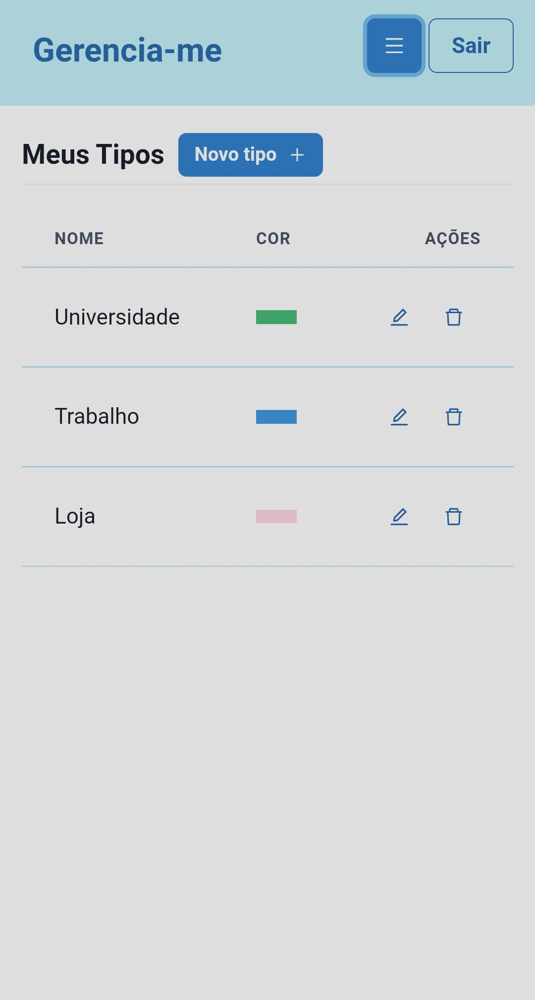

<div id="top"></div>

<!-- PROJECT LOGO -->
<br />
<div align="center">


  <h1 align="center">Gerencia-me</h1>

  <p align="center">
    A simple task manager application!
    </br>
    Deployed at: https://gerencia-me.herokuapp.com/
  </p>
</div>

<!-- SUMMARY -->
<details>
  <summary>Summary</summary>
  <ol>
    <li><a href="#about">About</a></li>
    <li><a href="#features">Features</a></li>
    <li>
      <a href="#layout">Layout</a>
      <ul>
        <li><a href="#mobile">Mobile</li>
        <li><a href="#desktop">Desktop</li>
      </ul>
    </li>
    <li>
      <a href="#how-it-works">How it works</a>
      <ul>
        <li><a href="#pre-requisites">Pre-requisites</li>
        <li><a href="#built-with">Built With</li>
      </ul>
    </li>
    <li><a href="#license">License</a></li>
    <li><a href="#contact">Contact</a></li>
    <li><a href="#acknowledgments">Acknowledgments</a></li>
  </ol>
</details>

<!-- ABOUT -->
## About

Gerencia-me it's a simple portfolio application for helping you with your daily tasks.
Create your categories to highlight specific tasks, create tasks, move tasks as their progress, delete tasks by their status.
All of this with a responsive design on both mobile and PC.

<p align="right">(<a href="#top">back to top</a>)</p>

<!-- FEATURES -->
## Features

- [x] Register as user
- [x] Login as user
- [x] Create/edit/remove categories
- [x] Create/edit/move/remove tasks
- [x] Delete all tasks by status 
- [x] Responsive design
- [ ] Keep tasks order when move tasks

See the [open issues](https://github.com/felipeemerson/gerencia-me/issues) for more info.

<p align="right">(<a href="#top">back to top</a>)</p>

<!-- LAYOUT -->
## Layout
### Mobile

<p align="center">
  
  
  
  
</p>

### Desktop

<p align="center" style="display: flex; align-items: flex-start; justify-content: center;">
  
  
  
  
</p>

## How it works
This project has two parts:
    
  <ul>
  <li>Backend (root folder)</li>
  <li>Frontend (client folder)</li>
  </ul>

### Pre-requisites
Before you begin, you will need to have the following tools installed on your machine: [Git](https://git-scm.com), [Node.js](https://nodejs.org/en/) and [MongoDB](https://www.mongodb.com/try/download/community).
In addition, it is good to have an editor to work with the code like [VSCode](https://code.visualstudio.com/)

#### Running both frontend and backend

```bash

# Clone this repository
$ git clone https://github.com/felipeemerson/gerencia-me.git

# Access the project folder cmd/terminal
$ cd gerencia-me

# Install the backend dependencies
$ npm i

# Go to client folder
$ cd client

# Install the frontend dependencies
$ npm i

# Back to root folder
$ cd ..

# Install concurrently globally to run both frontend and backend
$ npm install -g concurrently

# set gerenciame_jwtPrivateKey environment variable
$ export gerenciame_jwtPrivateKey=YOUR_VALUE

# Run the application in development mode
$ npm run dev
```
### Built With

The following tools were used in the construction of the project:
#### **Frontend**  ([React](https://reactjs.org/))
-   **[Chakra UI](https://chakra-ui.com/)**
-   **[React Router Dom](https://reactrouter.com/)**
-   **[React Icons](https://react-icons.github.io/react-icons/)**
-   **[Axios](https://github.com/axios/axios)**
-   **[React Query](https://react-query.tanstack.com/)**
-   **[React Beautiful Dnd](https://github.com/atlassian/react-beautiful-dnd)**
-   **[Formik](https://formik.org/docs/overview)**
-   **[Yup](https://github.com/jquense/yup)**
> See the file  [package.json](https://github.com/felipeemerson/gerencia-me/blob/main/client/package.json)

#### **Backend** ([Node.js](https://nodejs.org/en/))
-   **[Express](https://expressjs.com/)**
-   **[Mongoose](https://mongoosejs.com/)**
-   **[JSON Web Token](https://github.com/auth0/node-jsonwebtoken)**
-   **[Joi](https://joi.dev/)**
-   **[Joi ObjectId](https://github.com/mkg20001/joi-objectid)**
-   **[Bcrypt](https://github.com/kelektiv/node.bcrypt.js)**
-   **[Config](https://github.com/node-config/node-config)**
> See the file  [package.json](https://github.com/felipeemerson/gerencia-me/blob/main/package.json)

<p align="right">(<a href="#top">back to top</a>)</p>


<!-- CONTACT -->
## Contact

Felipe E. de O. Calixto - felipeemersonsb@gmail.com

<p align="right">(<a href="#top">back to top</a>)</p>

<!-- LICENSE -->
## License

Distributed under the MIT License. See `LICENSE.txt` for more information.

<p align="right">(<a href="#top">back to top</a>)</p>

<!-- ACKNOWLEDGMENTS -->
## Acknowledgments

* [Best README Template](https://github.com/othneildrew/Best-README-Template)
* [Chakra Color Picker](https://github.com/Buupu/chakra-color-picker)

<p align="right">(<a href="#top">back to top</a>)</p>
